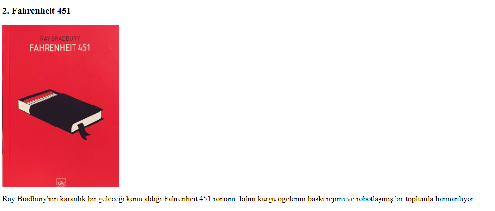

# Blog Sayfam
Html eğitiminde ilk oluşturduğum proje. 
Konu içeriği başlıklar ve paragraflar.





## Installation
Öncelikle projeyi clonelayın.
```bash
git clone https://github.com/mehmetziyaturan/htmlOdev1.git
```

## Usage
Projeyi cloneladıktan sonra Visual Studio Code programında açınız.

Linux için:
```linux
cd htmlOdev1
code .
```

## License
[MIT](https://choosealicense.com/licenses/mit/)
